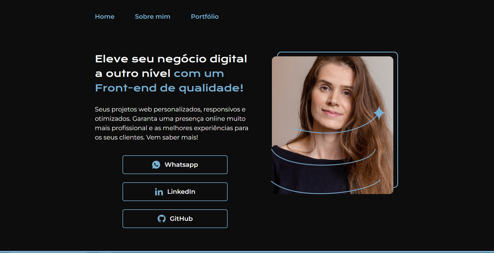

# Portfólio HTML e CSS

Repositório com projeto de portfólio desenvolvido com base na sequência de cursos HTML e CSS da [Alura](https://www.alura.com.br/) Escola Online de Tecnologia.

* HTML e CSS: ambientes de desenvolvimento, estrutura de arquivos e tags;
* HTML e CSS: Classes, posicionamento e Flexbox;
* HTML e CSS: cabeçalho, footer e variáveis CSS;
* HTML e CSS: trabalhando com responsividade e publicação de projetos.

## 📁 Detalhes do projeto

A aplicação foi desenvolvida com HTML e CSS puro.

Algumas adaptações foram feitas no [projeto original](https://www.figma.com/file/NrzJacC887svMVfF9oC2jM/Portfolio-Projeto-2?t=mUAL76anlOJEX7lQ-0) com a finalidade de usar a abordagem mobile-first.

Os breakpoints utilizados para o desenvolvimento do site foram 765px e 1024px.

	
	
    

 

## 🖥️ Acesso ao projeto

[Clique aqui](https://curso-html-css-kappa.vercel.app/) para acessar o portfólio no seu navegador.

## 👩‍💻 Tecnologias utilizadas

	
	

Feito com 💙 por [Juliana Lucca](https://www.linkedin.com/in/julianalucca/)